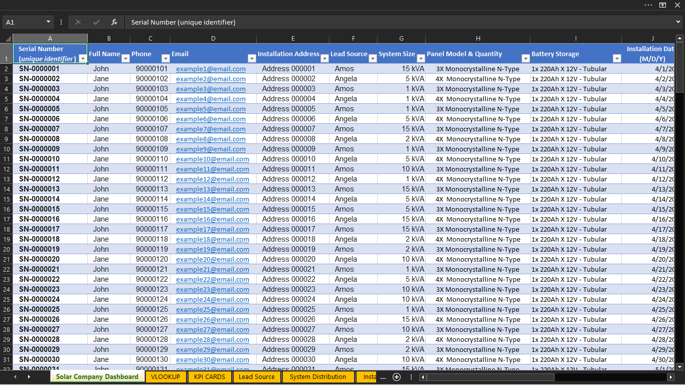

# Solar Company Data Analysis Project (Excel)

## 📌 Overview
This project is an Excel-based solar company analytics dashboard designed to manage customer installation records, retrieve customer information quickly, and generate business insights from solar installation data.

The workbook combines a customer lookup system with interactive dashboards to analyze customer volume, revenue performance, lead sources, solar system preferences, and installation trends.

## 🎯 Objective
To transform raw solar installation data into meaningful business insights by:

- Improving customer information retrieval
- Tracking key business performance indicators
- Understanding customer acquisition channels
- Identifying popular solar system sizes
- Monitoring installation trends over time

## 🛠 Tools Used
- Microsoft Excel
- VLOOKUP
- PivotTables
- Pivot Charts
- Excel Formulas
- Data Visualization
- Dashboard Design

## ⚙️ How It Works
- Each customer is assigned a unique serial number identifier
- The user enters a customer's serial number into the lookup dashboard
- Excel retrieves the customer's information automatically using VLOOKUP
- PivotTables summarize the dataset into business metrics
- Charts and KPI cards display important insights

## 📊 Features
### Customer Lookup Dashboard

- Retrieves customer records instantly using a unique serial number
- Displays:
  - Customer details
  - Installation information
  - Solar system specifications
  - Contract details
  - Payment information

### Executive KPI Dashboard

Displays high-level metrics including:

- Total customers
- Revenue generated
- Average system size
- Period-over-period customer comparison

### Lead Source Analysis

Answers the question:

> Which sales agent/channel brings in the most customers?

Tracks customer acquisition performance by lead source.

### System Distribution Analysis

Answers the question:

> What solar system sizes are most popular?

Shows customer preference across different solar capacities.

### Installation Trend Analysis

Answers the question:

> Are installations increasing or declining?

Tracks monthly installation activity over time.

## 📁 Files Included
- `SOLAR DASHBOARD.xlsx` — Main Excel dashboard file
- `dashboard-preview.png` — Dashboard screenshot
- `vlookup-preview.png` — Customer lookup screenshot

## 🔍 Key Insight
The dashboard converts raw customer records into actionable insights that can help a solar company:

- Understand customer demand
- Improve sales decisions
- Monitor revenue performance
- Plan inventory based on popular system sizes
- Reduce time spent searching customer records

## 📷 Preview

