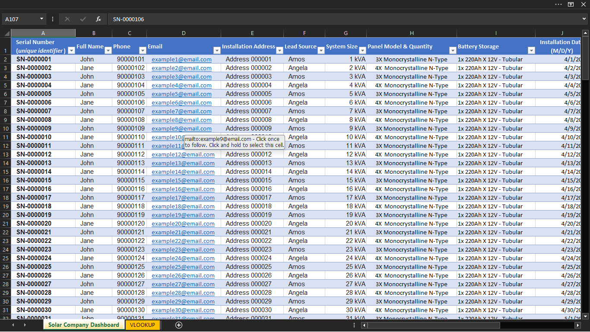

# Solar Customer Lookup Dashboard (Excel VLOOKUP)

## 📌 Overview
This project is an Excel-based dashboard designed for solar companies to quickly retrieve customer information using a unique serial number.

## 🎯 Objective
To simplify customer data access and improve operational efficiency by enabling instant lookup of customer records.

## 🛠 Tools Used
- Microsoft Excel
- VLOOKUP (Excel lookup automation)

## ⚙️ How It Works
- Each customer has a unique serial number
- The user inputs the serial number into the dashboard
- VLOOKUP retrieves and displays the corresponding customer details automatically

## 📊 Features
- Fast customer data retrieval
- User-friendly dashboard interface
- Organized dataset for easy management

## 📁 Files Included
- `SOLAR DASHBORD.xlsx` – Main dashboard file
- `dashboard-preview.png` – Screenshot of dashboard
- `vlookup-preview.png` – Screenshot of VLOOKUP

## 🔍 Key Insight
This solution reduces manual searching time and minimizes errors when accessing customer records.

## 📷 Preview

